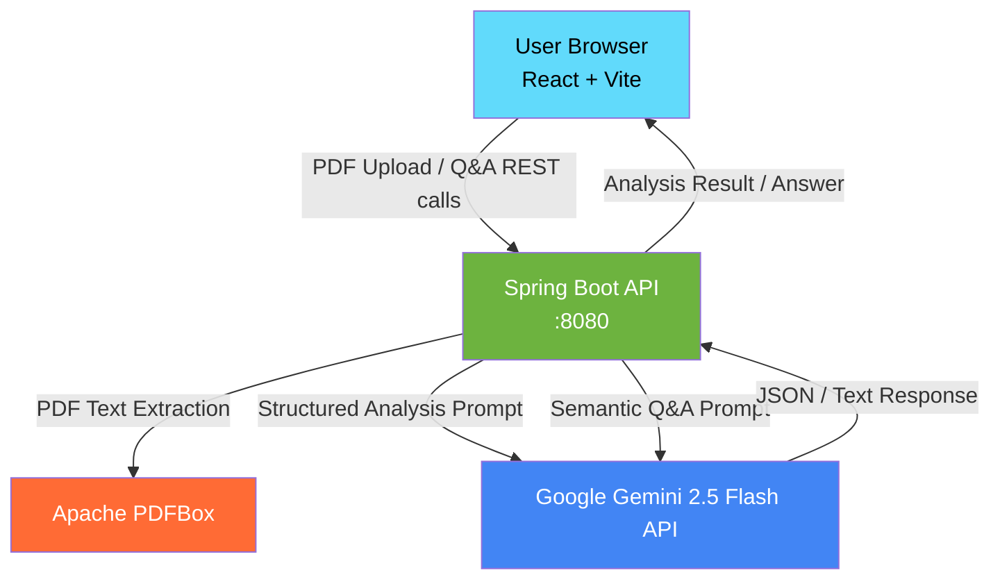

# 🧠 PaperSage

> **AI-powered research paper summarization & semantic Q&A**


---

## 📖 What is PaperSage?

PaperSage is a full-stack web application that transforms dense academic PDFs into clear, structured intelligence — instantly. Upload any CS research paper and PaperSage will:

- **Summarize** the paper into concise, actionable bullet points
- **Extract key contributions** so you know exactly what's novel
- **Build a glossary** of important terms with plain-language definitions
- **Answer your questions** semantically using the paper's own content as context

Whether you're a researcher, student, or engineer trying to stay current, PaperSage cuts through the noise so you can focus on what matters.

---

## ✨ Features

| Feature | Description |
|---|---|
| 📄 **PDF Upload** | Drag-and-drop or click to upload research paper PDFs (up to 50 MB) |
| 🔍 **Executive Summary** | 5–8 bullet-point overview of the paper's core ideas |
| 🏆 **Key Contributions** | 3–7 bullet points on what's new and why it matters |
| 📚 **Glossary** | 5–15 domain terms explained in plain English |
| 💬 **Semantic Q&A** | Ask any question about the paper; get grounded, cited answers |
| ⚡ **Fast AI** | Powered by Google Gemini 2.5 Flash for low-latency responses |

---

## 🏗️ Architecture



**Request Flow:**
1. The **React frontend** sends a `multipart/form-data` PDF upload to the Spring Boot API.
2. The backend extracts raw text using **Apache PDFBox**.
3. The text is passed to **Google Gemini 2.5 Flash** via a structured prompt, which returns summary, contributions, and glossary as structured JSON.
4. For Q&A, the paper text is chunked and a grounding prompt is constructed before querying Gemini.
5. Results are returned to the frontend and rendered in a clean UI.

---

## 🛠️ Tech Stack

### Backend
| Technology | Version | Role |
|---|---|---|
| Java | 21 | Runtime |
| Spring Boot | 3.x | Web framework |
| Apache PDFBox | 3.x | PDF text extraction |
| LangChain4j | Latest | Gemini AI integration |
| Google Gemini | 2.5 Flash | AI model |
| Maven | 3.x | Build tool |

### Frontend
| Technology | Version | Role |
|---|---|---|
| React | 18 | UI framework |
| TypeScript | 5 | Type safety |
| Vite | 5 | Dev server & bundler |
| Tailwind CSS | 3 | Styling |
| Axios | Latest | HTTP client |

---

## 📁 Project Structure

```
papersage/
├── papersage_backend/          # Spring Boot REST API
│   ├── src/
│   │   ├── main/
│   │   │   ├── java/           # Application source code
│   │   │   └── resources/      # application.properties, etc.
│   │   └── test/               # Unit & integration tests
│   ├── pom.xml
│   └── README.md               # Backend-specific documentation
│
├── papersage_frontend/         # React + Vite SPA
│   ├── src/
│   │   ├── components/         # Reusable UI components
│   │   ├── pages/              # Page-level views
│   │   ├── services/           # API call logic (Axios)
│   │   └── main.tsx            # App entry point
│   ├── package.json
│   ├── vite.config.js
│   └── README.md               # Frontend-specific documentation
│
├── memory-bank/                # Project context documentation
└── README.md                   # This file
```

---

## 🚀 Quick Start

### Prerequisites

- **Java 21+** — [Download](https://adoptium.net/)
- **Maven 3.8+** — [Download](https://maven.apache.org/)
- **Node.js 18+** — [Download](https://nodejs.org/)
- **Google Gemini API Key** — [Get one here](https://aistudio.google.com/app/apikey)

### 1. Clone the Repository

```bash
git clone https://github.com/your-username/papersage.git
cd papersage
```

### 2. Start the Backend

```bash
cd papersage_backend

# Set your Gemini API key (or add to application.properties)
# Windows
set GEMINI_API_KEY=your_api_key_here

# macOS/Linux
export GEMINI_API_KEY=your_api_key_here

mvn spring-boot:run
```

The API will be available at `http://localhost:8080`.

### 3. Start the Frontend

Open a new terminal:

```bash
cd papersage_frontend

# Copy the example env file and fill in your values
cp .env.example .env

npm install
npm run dev
```

The app will be available at `http://localhost:5173`.

---

## 📚 Documentation

| Link | Description |
|---|---|
| [Backend README](./papersage_backend/README.md) | API reference, configuration, build details |
| [Frontend README](./papersage_frontend/README.md) | Component overview, environment setup, build |

---

## 🤝 Contributing

1. Fork the repository
2. Create a feature branch: `git checkout -b feature/amazing-feature`
3. Commit your changes: `git commit -m 'feat: add amazing feature'`
4. Push to the branch: `git push origin feature/amazing-feature`
5. Open a Pull Request

---

## 📄 License

This project is licensed under the MIT License. See the [LICENSE](LICENSE) file for details.

---

<div align="center">
  <sub>Built with ☕ Java, ⚛️ React, and 🤖 Google Gemini</sub>
</div>
