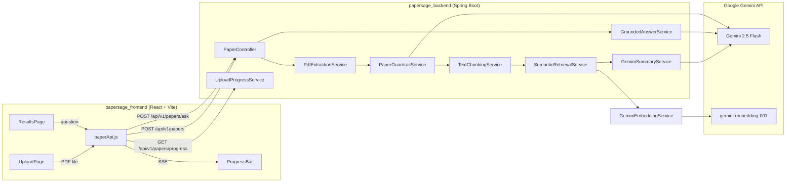

# 📄 PaperSage

**AI-powered research paper summarization & Q&A**

[](https://openjdk.org/projects/jdk/21/)
[](https://spring.io/projects/spring-boot)
[](https://react.dev/)
[](https://vite.dev/)
[](https://tailwindcss.com/)
[](https://ai.google.dev/)

---

## Overview

PaperSage lets you upload a Computer Science research paper (PDF) and instantly receive a structured, actionable analysis — plus the ability to ask natural-language questions about the paper's content.

The service extracts text, verifies the document is a CS paper, generates a structured summary using Google Gemini, and provides a RAG-powered semantic Q&A pipeline — all streamed to the browser with real-time progress updates.

---

## ✨ Features

- **PDF Upload & Text Extraction** — Upload PDFs up to 50 MB; text is extracted via Apache PDFBox.
- **CS Guardrail Classification** — Gemini verifies the document is a CS research paper before processing (rejects non-CS papers with HTTP 422).
- **Structured Analysis** — Generates:
  - Executive summary (5–8 bullet points)
  - Key contributions (3–7 bullet points)
  - Glossary of important terms (5–15 entries with plain-language definitions)
  - Prerequisite knowledge (math + AI/ML topics)
- **Semantic Q&A (RAG)** — Chunks text, embeds with Gemini `gemini-embedding-001`, retrieves top-k relevant chunks, and generates grounded answers with source citations.
- **Real-Time Progress** — Server-Sent Events (SSE) stream pipeline progress to a live progress bar in the browser.

---

## 🏗️ Architecture



---

## 🛠️ Tech Stack

| Layer      | Technology                                                                  |
| ---------- | --------------------------------------------------------------------------- |
| Frontend   | React 19, Vite 6, Tailwind CSS 4, JavaScript/JSX                           |
| Backend    | Java 21, Spring Boot 3.5, Apache PDFBox 3.0, Maven                         |
| AI / LLM   | Google Gemini 2.5 Flash (analysis & Q&A), Gemini `gemini-embedding-001` (embeddings) |
| Streaming  | Server-Sent Events (SSE)                                                   |

---

## 📁 Project Structure

```
papersage/
├── papersage_backend/        # Spring Boot REST API
│   ├── src/main/java/...     #   Controllers, services, DTOs, config
│   ├── pom.xml               #   Maven build
│   └── README.md             #   Backend documentation
│
├── papersage_frontend/       # React SPA
│   ├── src/                  #   Pages, components, API layer
│   ├── package.json          #   npm build
│   └── README.md             #   Frontend documentation
│
└── README.md                 # ← You are here
```

---

## 🚀 Quick Start

### Prerequisites

| Tool         | Version |
| ------------ | ------- |
| Java (JDK)   | 21+     |
| Node.js      | 18+     |
| npm           | 9+      |
| Gemini API Key | [Get one here](https://aistudio.google.com/apikey) |

### 1. Clone the repository

```bash
git clone https://github.com/<your-username>/papersage.git
cd papersage
```

### 2. Start the backend

```bash
cd papersage_backend

# Set your Gemini API key (choose one):

#   Option A – environment variable
export GEMINI_API_KEY=your-key-here        # Linux/macOS
set GEMINI_API_KEY=your-key-here           # Windows CMD

#   Option B – secrets.properties file (recommended)
#   Create src/main/resources/secrets.properties with:
#     gemini.api.key=your-key-here
#   (Already imported by application.yaml via spring.config.import)

./mvnw spring-boot:run          # Linux/macOS
mvnw.cmd spring-boot:run        # Windows
```

The API starts at **http://localhost:8080**.

### 3. Start the frontend

```bash
cd papersage_frontend
npm install

# (Optional) Create .env from the example:
cp .env.example .env
# Default VITE_API_BASE_URL is http://localhost:8080

npm run dev
```

The app opens at **http://localhost:5173**.

---

## 📡 API Overview

All endpoints are under the base path `/api/v1/papers`.

| Method | Endpoint                       | Description                                  |
| ------ | ------------------------------ | -------------------------------------------- |
| `POST` | `/api/v1/papers`               | Upload a PDF → returns structured analysis   |
| `GET`  | `/api/v1/papers/progress`      | SSE stream of pipeline progress events       |
| `POST` | `/api/v1/papers/ask?question=` | Ask a question → grounded answer with sources |
| `POST` | `/api/v1/papers/query?question=` | Retrieve top matching text chunks            |

> See the [Backend README](./papersage_backend/README.md) for full API reference with request/response schemas.

---

## 📚 Further Reading

- [**Backend README**](./papersage_backend/README.md) — API reference, DTOs, services, configuration, error handling
- [**Frontend README**](./papersage_frontend/README.md) — Components, pages, environment variables, build commands

---

## 📝 License

This project is for educational and personal use. See the repository for license details.
