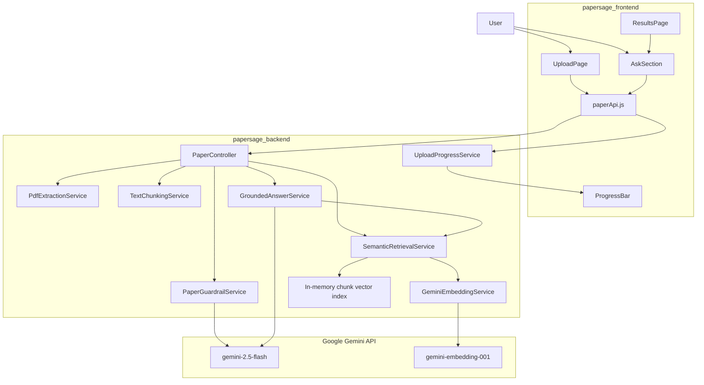

# RAG Architecture

## Architectural Role

PaperSage's RAG architecture allows a user to ask questions about the uploaded paper while keeping the generated answer grounded in retrieved text chunks from that paper. The system does not train a model or persist vectors. Instead, it creates a temporary in-memory semantic index for the latest uploaded paper and uses Gemini to generate answers from retrieved context.

## Component Diagram

### Text Alternative

The user uploads a PDF or asks a question through the React frontend. Frontend API calls reach `PaperController`. During upload, `PaperController` calls extraction, guardrail, chunking, embedding, and retrieval-index services. During question answering, `PaperController` calls `GroundedAnswerService`, which retrieves relevant chunks through `SemanticRetrievalService` and asks Gemini 2.5 Flash to answer from those chunks only.

## Component Responsibilities

| Component | Responsibility in RAG |
|---|---|
| `PaperController` | HTTP entry point for upload, query, ask, and progress endpoints; orchestrates upload-time indexing and delegates ask-time RAG. |
| `TextChunkingService` | Converts extracted paper text into overlapping chunks with IDs, sequence indexes, and optional section labels. |
| `GeminiEmbeddingService` | Calls Gemini embedding API for document chunks and queries; applies concurrency, retry, jitter, and timeout controls for document embeddings. |
| `SemanticRetrievalService` | Maintains the in-memory vector index; embeds questions; computes cosine similarity; returns ranked top-k chunks. |
| `GroundedAnswerService` | Builds the grounded prompt from retrieved chunks, calls Gemini 2.5 Flash, and returns answer plus source references. |
| `UploadProgressService` | Streams SSE progress for upload-time extraction, chunking, embedding, and analysis stages. |
| `AskSection` | Frontend UI for user questions, answers, errors, loading state, and source badges. |
| `paperApi.js` | Frontend API adapter for upload and ask requests. |

## Boundary Decisions

### Backend Boundary

The backend owns all RAG behavior: chunking, embeddings, retrieval, prompt construction, and Gemini calls. The frontend does not perform retrieval logic; it only uploads files, sends questions, and renders results.

### Model Boundary

PaperSage uses two Gemini model capabilities:

- `gemini-embedding-001` for vector embeddings.
- `gemini-2.5-flash` for generative analysis, guardrail classification, and grounded answers.

### Persistence Boundary

The RAG index is stored in process memory in `SemanticRetrievalService`. There is no database, vector store, durable cache, or multi-user isolation layer in the current MVP.

## Important Architectural Constraints

- Uploading a new paper replaces the previously indexed chunks.
- A process restart loses all indexed content.
- Retrieval scans the in-memory list directly; there is no approximate nearest neighbor index.
- The current index is global to the backend instance, not scoped by user, session, or upload job.
- Grounding depends on prompt instructions and retrieved context quality, not on hard model-level guarantees.
