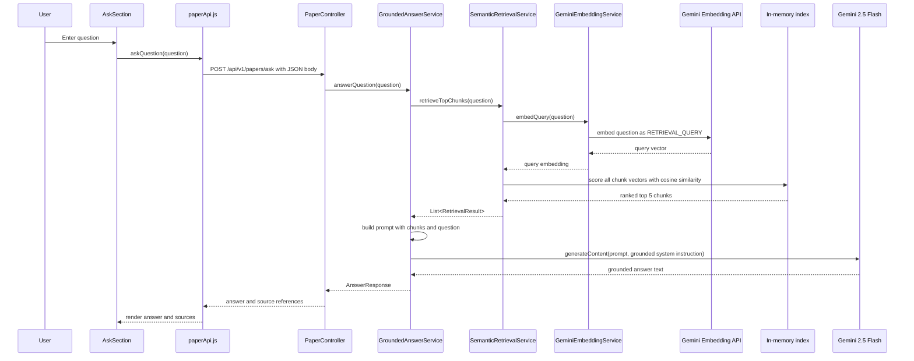
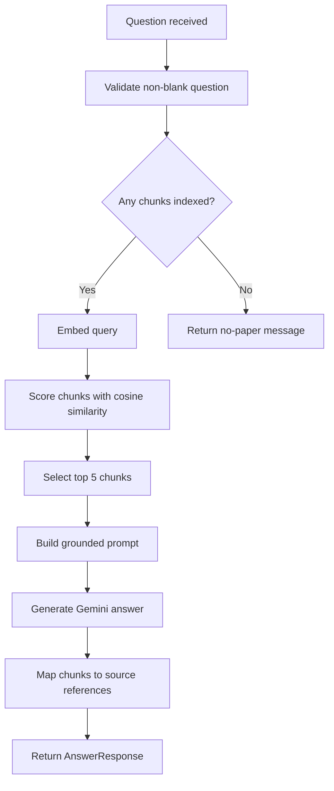

# Ask-Time RAG Pipeline

## Purpose

The ask-time RAG pipeline answers a user's natural-language question using the indexed chunks from the most recently uploaded paper. It is exposed through `POST /api/v1/papers/ask` and implemented primarily by `GroundedAnswerService` and `SemanticRetrievalService`.

## Ask Sequence



### Text Alternative

The user submits a question in `AskSection`. The frontend sends JSON to `/api/v1/papers/ask`. The backend embeds the question, compares it to the in-memory chunk embeddings, retrieves the top 5 chunks, builds a grounded prompt, asks Gemini 2.5 Flash for an answer, and returns the answer with source references.

## Step-by-Step Flow

### 1. Frontend Request

Source: `papersage_frontend/src/api/paperApi.js`

The frontend sends a JSON request to `POST /api/v1/papers/ask` with a `question` field.

### 2. Controller Validation

Source: `PaperController.askPaper(...)`

The controller resolves the question from the JSON body first. A query-parameter fallback still exists for temporary backward compatibility. Blank questions return HTTP 400.

### 3. Retrieval

Source: `SemanticRetrievalService.retrieveTopChunks(...)`

Retrieval has four substeps:

1. Verify chunks are indexed.
2. Embed the question using query-specific task type `RETRIEVAL_QUERY`.
3. Score each indexed chunk with cosine similarity.
4. Sort descending and return the top 5.

### 4. Cosine Similarity

Source: `SemanticRetrievalService.cosineSimilarity(...)`

The scoring function computes:

```text
similarity = dot(queryVector, chunkVector) / (norm(queryVector) * norm(chunkVector))
```

If the denominator is zero, similarity is reported as `0.0`. Results are sorted by `similarityScore` descending.

### 5. Grounded Prompt Construction

Sources: `GroundedAnswerService.buildGroundedPrompt(...)` and `papersage_backend/src/main/resources/prompts/grounded-answer.txt`

Each retrieved chunk is formatted with a display chunk number, original `chunkIndex`, optional `sectionLabel`, and full chunk text. The prompt instructs Gemini to use only the provided chunks, avoid outside knowledge, avoid assumptions, return a fixed not-found message when context is insufficient, and keep the answer concise.

### 6. Grounded Generation

Source: `GroundedAnswerService.answerQuestion(...)`

| Setting | Value |
|---|---|
| Model | `gemini-2.5-flash` |
| Temperature | `0.2` |
| System role | Precise research paper Q&A assistant using only provided context. |

Blank Gemini responses are treated as errors.

### 7. Source References

Source: `GroundedAnswerService.toSourceReference(...)`

The service maps each retrieved chunk to a lightweight `SourceReference` containing `chunkId`, `chunkIndex`, `sectionLabel`, and `similarityScore`. The answer response does not include full source chunk text.

## Ask-Time Decision Flow



### Text Alternative

After receiving a question, the backend validates it. If no chunks are indexed, it returns a no-paper message. If chunks exist, it embeds the query, scores chunks, selects the top 5, builds the grounded prompt, generates an answer, maps sources, and returns the response.
