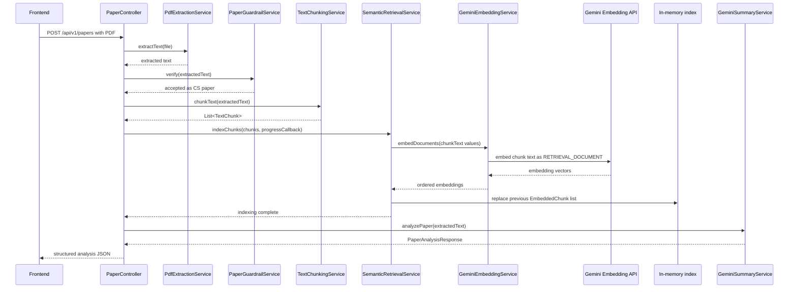
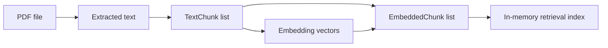

# Upload-Time RAG Indexing Pipeline

## Purpose

The indexing pipeline creates the temporary retrieval corpus that later powers Ask-the-Paper. It runs as part of `POST /api/v1/papers` after the PDF is uploaded.

## Upload and Indexing Sequence

### Text Alternative

The frontend uploads a PDF to `PaperController`. The backend extracts text, verifies the document is a CS research paper, chunks the text, embeds each chunk, replaces the in-memory retrieval index with the new chunk/vector pairs, generates the paper analysis, and returns the analysis response to the frontend.

## Step-by-Step Flow

### 1. Upload Validation

Source: `PaperController.uploadPaper(...)`

The controller validates that the uploaded file is not empty and that the content type is `application/pdf`. Invalid uploads return HTTP 400 from the controller path.

### 2. Text Extraction

Source: `PdfExtractionService` called by `PaperController`

The backend extracts full text from the uploaded PDF. This extracted text becomes the input for both RAG indexing and structured paper analysis.

### 3. CS Guardrail

Source: `PaperGuardrailService.verify(extractedText)`

The guardrail runs before chunking and embedding to avoid spending embedding/generation quota on unsupported documents. Non-CS documents are rejected with `NotACsResearchPaperException`, mapped to HTTP 422 by `GlobalExceptionHandler`.

### 4. Chunking

Source: `TextChunkingService.chunkText(String fullText)`

| Setting | Current value |
|---|---|
| Approximate chars per token | 4 |
| Target minimum chunk size | 500 tokens / about 2000 chars |
| Target maximum chunk size | 900 tokens / about 3600 chars |
| Overlap | 100 tokens / about 400 chars |
| Boundary strategy | Prefer sentence-ending punctuation followed by whitespace. |
| Section labels | Regex-based detection from the first 300 chars of each chunk. |

Each `TextChunk` contains a UUID `chunkId`, `chunkText`, zero-based `chunkIndex`, and optional `sectionLabel`.

### 5. Document Embedding

Sources: `SemanticRetrievalService.indexChunks(...)` and `GeminiEmbeddingService.embedDocuments(...)`

`SemanticRetrievalService` maps each chunk to its `chunkText` and asks `GeminiEmbeddingService` to generate embeddings. Document embeddings use Gemini task type `RETRIEVAL_DOCUMENT`.

The current embedding implementation:

- Uses `gemini-embedding-001`.
- Uses Java 21 virtual threads for one task per chunk.
- Applies a semaphore-based concurrency gate.
- Preserves result order by storing vectors into preallocated result slots.
- Emits per-chunk progress through an optional callback.
- Retries retryable failures with capped exponential backoff and jitter.
- Applies a completion timeout to avoid indefinite upload hangs.

### 6. In-Memory Index Replacement

Source: `SemanticRetrievalService.indexChunks(...)`

After embeddings are returned, the service clears the previous `embeddedChunks` list and stores new `EmbeddedChunk` records. This means each upload replaces the previous paper's retrieval corpus.

## Data Lifecycle Diagram

### Text Alternative

A PDF becomes extracted text. Extracted text becomes ordered chunks. Chunks are embedded into vectors. Each chunk is paired with its vector as an `EmbeddedChunk`. The `EmbeddedChunk` list becomes the in-memory retrieval index.

## SSE Progress During Indexing

Source: `PaperController` and `UploadProgressService`

| Stage | Approximate percent | Meaning |
|---|---:|---|
| `extracting` | 10 | Extracting PDF text. |
| `classifying` | 15 | Verifying CS research-paper guardrail. |
| `chunking` | 20 | Splitting text into chunks. |
| `embedding` | 20 to 75 | Embedding chunks; progress scales with completed chunk count. |
| `analyzing` | 80 | Generating structured analysis. |
| `done` | final event | Upload pipeline completed. |

## Indexing Failure Modes

| Failure | Current handling |
|---|---|
| Non-PDF or empty upload | HTTP 400 from controller path. |
| Non-CS research paper | HTTP 422 with `NOT_A_CS_RESEARCH_PAPER`. |
| PDF extraction failure | HTTP 422 with `PDF_PROCESSING_FAILED`. |
| Gemini embedding failure | HTTP 503 with `EMBEDDING_SERVICE_UNAVAILABLE`. |
| Gemini analysis failure | HTTP 503 with `ANALYSIS_SERVICE_UNAVAILABLE`. |
| Unexpected runtime error | HTTP 500 with `INTERNAL_ERROR`. |
