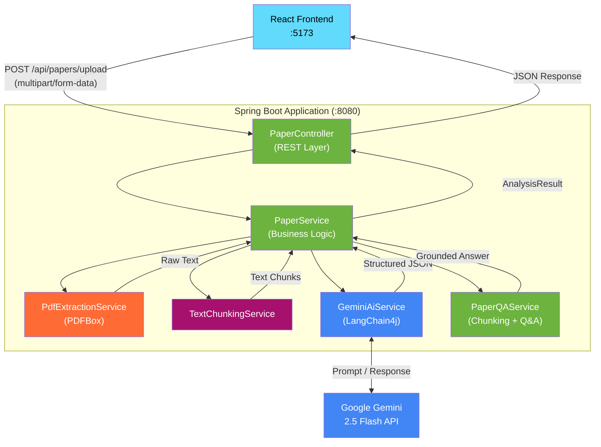

# 🔧 PaperSage — Backend

> Spring Boot REST API powering AI-driven research paper analysis and semantic Q&A.


---

## 📖 Overview

The PaperSage backend is a Java 21 / Spring Boot 3 REST service responsible for:

1. **Accepting PDF uploads** and extracting raw text using Apache PDFBox.
2. **Generating structured analysis** (summary, key contributions, glossary) via Google Gemini 2.5 Flash.
3. **Answering semantic questions** about uploaded papers by grounding Gemini responses in the paper's extracted text.

---

## 🏗️ Architecture



### Layers

| Layer | Responsibility |
|---|---|
| **Controller** | Receives HTTP requests, validates input, returns responses |
| **Service** | Orchestrates PDF extraction + AI analysis |
| **PdfExtractionService** | Uses Apache PDFBox to extract raw text from uploaded PDFs |
| **GeminiAiService** | Constructs structured prompts and calls the Gemini API via LangChain4j |
| **PaperQAService** | Chunks paper text, builds grounding context, and answers user questions |

---

## 📁 Project Structure

```
papersage_backend/
├── src/
│   ├── main/
│   │   ├── java/
│   │   │   └── com/papersage/
│   │   │       ├── PapersageApplication.java      # Spring Boot entry point
│   │   │       ├── controller/
│   │   │       │   └── PaperController.java        # REST endpoints
│   │   │       ├── service/
│   │   │       │   ├── PaperService.java            # Core orchestration
│   │   │       │   ├── PdfExtractionService.java    # PDF → text
│   │   │       │   ├── GeminiAiService.java         # Gemini integration
│   │   │       │   └── PaperQAService.java          # Semantic Q&A
│   │   │       ├── model/
│   │   │       │   ├── PaperAnalysis.java           # Analysis result record
│   │   │       │   ├── GlossaryEntry.java           # Term + definition record
│   │   │       │   └── QARequest.java               # Q&A request record
│   │   │       └── config/
│   │   │           └── WebConfig.java               # CORS configuration
│   │   └── resources/
│   │       └── application.properties               # App configuration
│   └── test/
│       └── java/
│           └── com/papersage/                       # Unit & integration tests
├── pom.xml
├── mvnw / mvnw.cmd                                  # Maven wrapper
└── README.md
```

---

## 🌐 API Reference

### Base URL
```
http://localhost:8080/api
```

---

### `POST /api/papers/upload`

Upload a PDF and receive a full structured analysis.

**Request**

| Type | Value |
|---|---|
| Content-Type | `multipart/form-data` |
| Body param | `file` — the PDF file (max 50 MB) |

```bash
curl -X POST http://localhost:8080/api/papers/upload \
  -F "file=@my_paper.pdf"
```

**Response `200 OK`**

```json
{
  "paperId": "a1b2c3d4-...",
  "title": "Attention Is All You Need",
  "summary": [
    "Introduces the Transformer architecture based solely on attention mechanisms.",
    "Eliminates recurrence and convolutions entirely.",
    "..."
  ],
  "keyContributions": [
    "Multi-head self-attention mechanism",
    "Positional encoding scheme",
    "..."
  ],
  "glossary": [
    {
      "term": "Self-Attention",
      "definition": "A mechanism that allows each position in a sequence to attend to all other positions."
    },
    "..."
  ]
}
```

**Error Responses**

| Status | Reason |
|---|---|
| `400 Bad Request` | No file provided or file is not a PDF |
| `413 Payload Too Large` | File exceeds 50 MB limit |
| `500 Internal Server Error` | PDF extraction or AI call failed |

---

### `POST /api/papers/{paperId}/ask`

Ask a semantic question about a previously uploaded paper.

**Request**

| Type | Value |
|---|---|
| Content-Type | `application/json` |
| Path param | `paperId` — ID returned from upload |

```bash
curl -X POST http://localhost:8080/api/papers/a1b2c3d4-.../ask \
  -H "Content-Type: application/json" \
  -d '{ "question": "What datasets were used to evaluate the model?" }'
```

**Response `200 OK`**

```json
{
  "question": "What datasets were used to evaluate the model?",
  "answer": "The authors evaluated their model on the WMT 2014 English-to-German and English-to-French translation tasks..."
}
```

**Error Responses**

| Status | Reason |
|---|---|
| `404 Not Found` | `paperId` does not exist |
| `400 Bad Request` | Question field is missing or empty |

---

## ⚙️ Configuration

All configuration lives in `src/main/resources/application.properties`. Sensitive values should be provided via environment variables.

### Required

| Property | Env Variable | Description |
|---|---|---|
| `gemini.api.key` | `GEMINI_API_KEY` | Your Google Gemini API key |

### Optional / Defaults

| Property | Default | Description |
|---|---|---|
| `server.port` | `8080` | Port the API runs on |
| `spring.servlet.multipart.max-file-size` | `50MB` | Max PDF upload size |
| `spring.servlet.multipart.max-request-size` | `50MB` | Max HTTP request size |
| `cors.allowed-origins` | `http://localhost:5173` | Allowed frontend origins |

### Example `application.properties`

```properties
# Server
server.port=8080

# Gemini AI
gemini.api.key=${GEMINI_API_KEY}

# File Upload
spring.servlet.multipart.max-file-size=50MB
spring.servlet.multipart.max-request-size=50MB

# CORS
cors.allowed-origins=http://localhost:5173
```

---

## 🚀 Getting Started

### Prerequisites

- **Java 21** — [Download Temurin 21](https://adoptium.net/)
- **Maven 3.8+** — [Download](https://maven.apache.org/) *(or use the included Maven Wrapper)*
- **Google Gemini API Key** — [Get one here](https://aistudio.google.com/app/apikey)

### 1. Set Environment Variables

**Windows (CMD)**
```cmd
set GEMINI_API_KEY=your_api_key_here
```

**Windows (PowerShell)**
```powershell
$env:GEMINI_API_KEY = "your_api_key_here"
```

**macOS / Linux**
```bash
export GEMINI_API_KEY=your_api_key_here
```

### 2. Build

```bash
# Compile and verify the project
mvn clean compile

# Run all tests
mvn clean verify
```

### 3. Run

```bash
# Using Maven
mvn spring-boot:run

# OR using the Maven Wrapper (no Maven installation required)
./mvnw spring-boot:run        # macOS/Linux
mvnw.cmd spring-boot:run      # Windows
```

The API will be available at **`http://localhost:8080`**.

### 4. Build a Production JAR

```bash
mvn clean package -DskipTests
java -jar target/papersage-backend-*.jar
```

---

## 🧪 Testing

```bash
# Run all unit and integration tests
mvn clean verify

# Run tests with coverage report
mvn clean verify jacoco:report
```

---

## 🐛 Known Issues & Status

- Paper state is currently **in-memory only** — restarting the server clears all uploaded papers.
- Very large PDFs (>30 pages) may approach Gemini's context window; chunking is applied for Q&A but analysis prompts use full text.
- PDF files with complex layouts or scanned images may produce lower-quality text extraction.

---

## 📄 License

MIT — see the root [LICENSE](../LICENSE) file for details.

← [Back to root README](../README.md)
