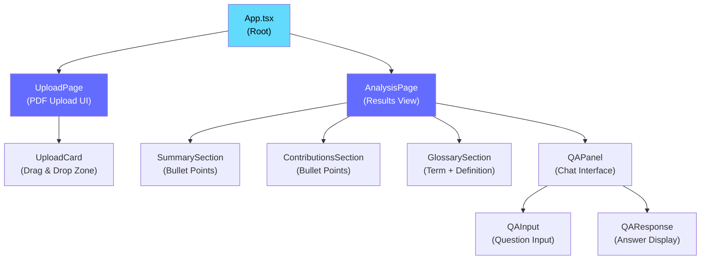

# 🎨 PaperSage — Frontend

> React + Vite single-page application for AI-powered research paper analysis.


---

## 📖 Overview

The PaperSage frontend is a responsive single-page application (SPA) built with **React 18**, **TypeScript**, and **Vite**. It provides a clean, intuitive interface for:

- Uploading CS research paper PDFs
- Viewing AI-generated structured analysis (summary, contributions, glossary)
- Asking semantic questions about uploaded papers via a chat-style interface

The frontend communicates exclusively with the [PaperSage Backend API](../papersage_backend/README.md) running at `http://localhost:8080`.

---

## ✨ Features

| Feature | Description |
|---|---|
| 📤 **PDF Upload** | Drag-and-drop or file picker to upload research papers |
| 📋 **Structured Analysis** | Collapsible sections for summary, contributions, and glossary |
| 💬 **Q&A Interface** | Chat-style panel for asking questions about the paper |
| 📱 **Responsive Design** | Works on desktop and tablet screen sizes |
| ⚡ **Fast Dev Server** | Vite HMR for instant feedback during development |

---

## 🖼️ UI Structure



---

## 📁 Project Structure

```
papersage_frontend/
├── public/                     # Static assets (favicon, etc.)
├── src/
│   ├── components/             # Reusable UI components
│   │   ├── UploadCard.tsx      # PDF drag-and-drop upload zone
│   │   ├── SummarySection.tsx  # Executive summary display
│   │   ├── ContributionsSection.tsx  # Key contributions display
│   │   ├── GlossarySection.tsx # Glossary term/definition display
│   │   └── QAPanel.tsx         # Semantic Q&A chat interface
│   ├── pages/
│   │   ├── UploadPage.tsx      # Main upload screen
│   │   └── AnalysisPage.tsx    # Analysis results screen
│   ├── services/
│   │   └── api.ts              # Axios API calls (upload, ask)
│   ├── types/
│   │   └── index.ts            # TypeScript interfaces & types
│   ├── App.tsx                 # Root component & routing
│   └── main.tsx                # Application entry point
├── index.html                  # HTML shell
├── .env.example                # Example environment variables
├── .env                        # Your local env (git-ignored)
├── package.json
├── tsconfig.json
├── vite.config.js
└── README.md
```

---

## ⚙️ Environment Variables

Copy `.env.example` to `.env` before starting the development server:

```bash
cp .env.example .env
```

| Variable | Default | Description |
|---|---|---|
| `VITE_API_BASE_URL` | `http://localhost:8080` | Base URL of the PaperSage backend API |

> **Note:** All Vite environment variables must be prefixed with `VITE_` to be accessible in the browser bundle.

### Example `.env`

```env
VITE_API_BASE_URL=http://localhost:8080
```

---

## 🚀 Getting Started

### Prerequisites

- **Node.js 18+** — [Download](https://nodejs.org/)
- **npm 9+** — bundled with Node.js
- The **PaperSage backend** running at `http://localhost:8080` — see [Backend README](../papersage_backend/README.md)

### 1. Install Dependencies

```bash
cd papersage_frontend
npm install
```

### 2. Configure Environment

```bash
cp .env.example .env
# Edit .env and set VITE_API_BASE_URL if the backend runs on a different port
```

### 3. Start the Development Server

```bash
npm run dev
```

The app will be available at **`http://localhost:5173`** with Hot Module Replacement (HMR) enabled.

---

## 🔨 Available Scripts

| Script | Command | Description |
|---|---|---|
| **dev** | `npm run dev` | Start the Vite dev server with HMR |
| **build** | `npm run build` | Compile TypeScript and bundle for production |
| **preview** | `npm run preview` | Preview the production build locally |
| **lint** | `npm run lint` | Run ESLint on all source files |

---

## 📦 Production Build

```bash
# Build optimized production bundle
npm run build

# Preview the production build locally before deploying
npm run preview
```

Output will be in the `dist/` directory. This directory is ready to be deployed to any static hosting service (Netlify, Vercel, S3, etc.).

---

## 🔀 Proxy / CORS Configuration

During development, Vite is configured to proxy API requests to the backend to avoid CORS issues. This is defined in `vite.config.js`:

```js
// vite.config.js
export default defineConfig({
  server: {
    proxy: {
      '/api': {
        target: 'http://localhost:8080',
        changeOrigin: true,
      },
    },
  },
});
```

In production, configure your hosting platform or reverse proxy (e.g., Nginx) to route `/api/*` requests to the backend service. Update `VITE_API_BASE_URL` accordingly.

---

## 🧰 Key Dependencies

| Package | Purpose |
|---|---|
| `react` + `react-dom` | UI framework |
| `typescript` | Static typing |
| `vite` | Build tool & dev server |
| `tailwindcss` | Utility-first CSS framework |
| `axios` | Promise-based HTTP client for API calls |
| `react-router-dom` | Client-side routing (if applicable) |

---

## 📄 License

MIT — see the root [LICENSE](../LICENSE) file for details.

← [Back to root README](../README.md)
